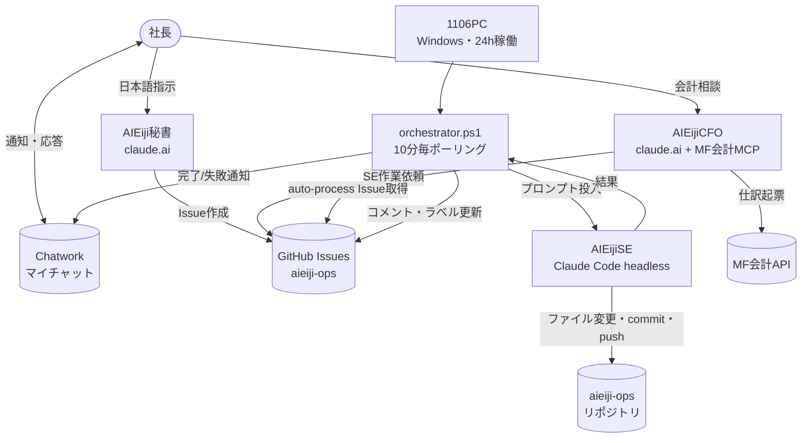
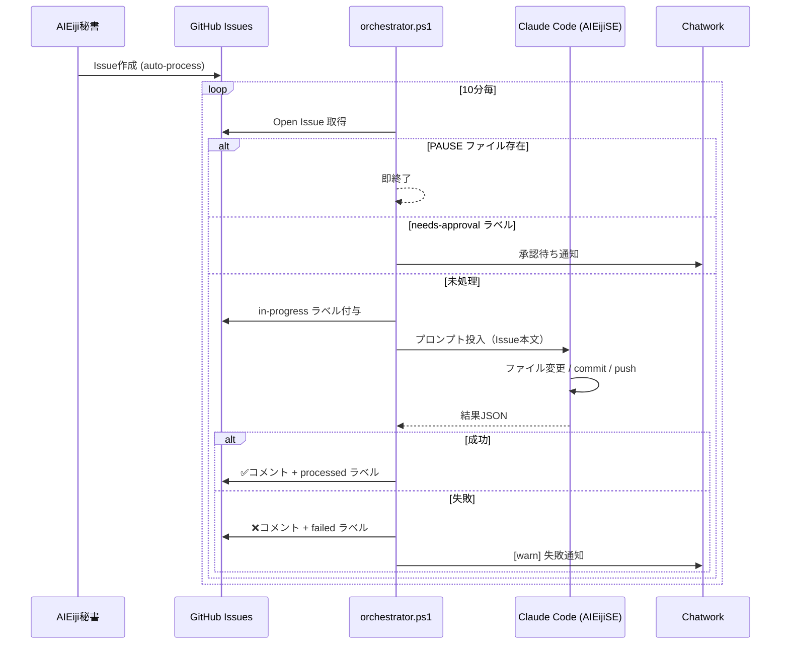
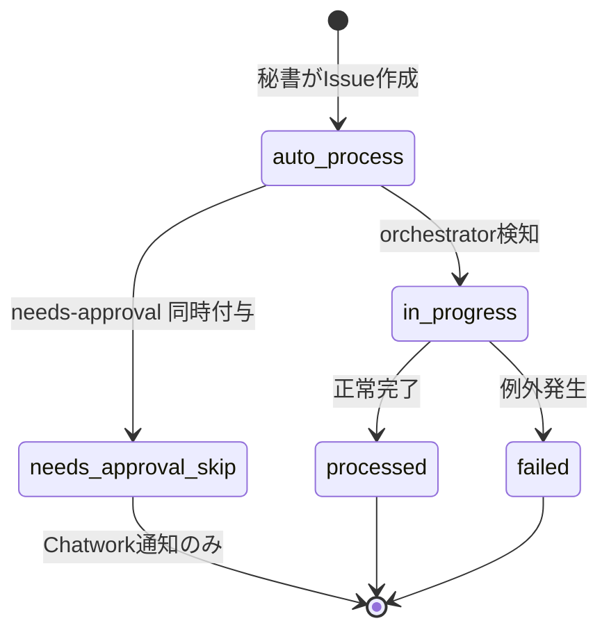

# AI EIJI アーキテクチャ

AI EIJI は、社長の指示を複数のAIエージェントに分担させ、1106PC上で自律実行する多重エージェント体制である。本ドキュメントはコンポーネント間の関係を Mermaid 図で可視化する。

## 1. コンポーネント一覧

| コンポーネント | 実体 | 役割 |
|---|---|---|
| AIEiji秘書 | claude.ai（スマホ/Web） | 社長との自然言語対話、GitHub Issue化 |
| AIEijiCFO | claude.ai + MF会計MCP | 会計・財務判断、仕訳起票 |
| AIEijiSE | 1106PC上の Claude Code（headless） | スクリプト実装、インフラ構築、自動化 |
| GitHub Issues | `sankaholdings/aieiji-ops` | 作業指示バス（キュー兼監査証跡） |
| 1106PC | 自宅・24h稼働 Windows機 | `orchestrator.ps1` 実行環境 |
| Chatwork | マイチャット（room 46076523） | 通知・承認要求・社長入力チャネル |

## 2. 全体構成

## 3. Issue処理フロー

`orchestrator.ps1` は 10 分毎にタスクスケジューラから起動され、`auto-process` ラベル付き Issue を処理する。

## 4. ラベルのライフサイクル

## 5. 責任分界

| レイヤ | 担当 | 代表成果物 |
|---|---|---|
| 指示 | 社長 → 秘書 | GitHub Issue |
| 分類・起票 | AIEiji秘書 / CFO | Issue 本文・ラベル |
| キュー | GitHub Issues | `auto-process` ラベル |
| 実行 | AIEijiSE（1106PC） | コミット・PR・スクリプト |
| 監視・通知 | orchestrator + Chatwork | `Action_Log.md`・Chatwork投稿 |

## 6. 安全装置

| 機構 | 実装場所 | 効果 |
|---|---|---|
| Kill switch | `C:\aieiji-ops\PAUSE` | ファイル存在で即終了 |
| ラベル制限 | `orchestrator.ps1` | `auto-process` のみ処理 |
| 承認フロー | `needs-approval` ラベル | 実行せず Chatwork 通知 |
| 冪等性 | `processed` / `in-progress` ラベル | 二重処理防止 |
| Mutex | `Global\AIEiji_AieijiOps_Mutex` | Action_Log 書込排他 |
| 監査証跡 | `logs/Action_Log.md` + Issue コメント | 全操作の追跡可能性 |

## 7. 参照

- [`README.md`](../README.md) — リポジトリ概要
- [`orchestrator/README.md`](../orchestrator/README.md) — orchestrator 詳細
- [`.github/ISSUE_TEMPLATE/se_workorder.md`](../.github/ISSUE_TEMPLATE/se_workorder.md) — SE作業指示テンプレ
